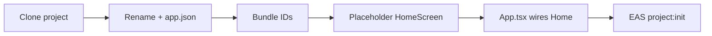
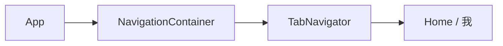
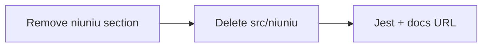
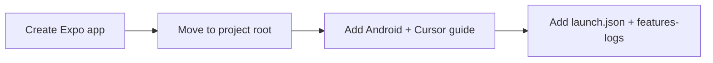

# Features / Changelog

## Rebrand + placeholder home (databasing-documents-mobile-apps)

- **Project name:** `databasing-documents-mobile-apps` in `package.json` and `app.json` (name + slug).
- **Native IDs:** iOS `bundleIdentifier` and Android `package` set to `com.herwidget.databasingdocuments`.
- **UI:** Previous calculator UI removed; app shows a placeholder home screen (`HomeScreen`) with app title and "Home — placeholder".
- **EAS:** New EAS project created and linked: `@herwidget/databasing-documents-mobile-apps` (ID: `38089b99-ce75-4136-a89f-dcee29a3ddac`). `app.json` → `extra.eas.projectId` updated.

## Tab: 我 (profile / settings)

- Bottom tab bar: **Home** and **我** (profile). React Navigation (`@react-navigation/native`, `@react-navigation/bottom-tabs`) + `react-native-screens`, `react-native-gesture-handler`. `TabNavigator` in `src/navigation/TabNavigator.tsx`; `ProfileScreen` placeholder in `src/screens/ProfileScreen.tsx`. Tab labels from `src/app-config.ts` (`TAB_LABEL_HOME`, `TAB_LABEL_PROFILE`).

## Remove niuniu (prior project code)

- Removed niuniu card calculator: docs (features-logs section), `src/niuniu/` (types, parse, combos, score, format, calc, tests), and related todo. Updated `jest.config.js` coverage pattern and docs EAS dashboard URL.

## Expo setup + Android & Cursor guide

- React Native project created with Expo (blank-typescript).
- Concise guide added: run on real Android device and debug in Cursor.

- **Run on device:** Enable USB debugging → `pnpm start` → Expo Go (QR or USB) or dev build.
- **Debug in Cursor:** React Native Tools + Expo extensions → Attach to packager (port 8081) → breakpoints in TS/TSX.
- **Android Studio:** `npx expo prebuild` → open project in Android Studio → run on emulator/device; use for native code and layout, keep Metro in Cursor. **Hot reload:** start `pnpm start` first, then Run from Android Studio so the app connects to Metro and Fast Refresh works.
