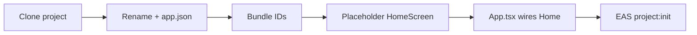
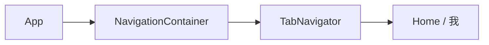
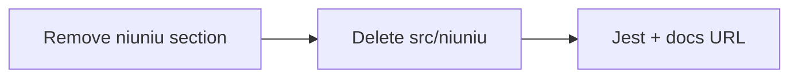
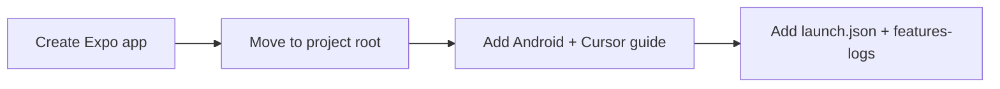
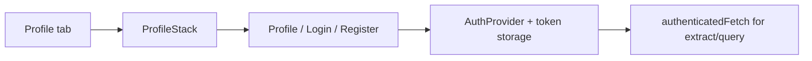
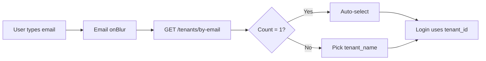
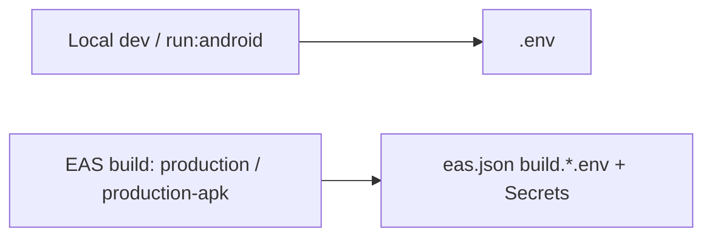

# Features / Changelog

## Rebrand + placeholder home (databasing-documents-mobile-apps)

- **Project name:** `databasing-documents-mobile-apps` in `package.json` and `app.json` (name + slug).
- **Native IDs:** iOS `bundleIdentifier` and Android `package` set to `com.herwidget.databasingdocuments`.
- **UI:** Previous calculator UI removed; app shows a placeholder home screen (`HomeScreen`) with app title and "Home — placeholder".
- **EAS:** New EAS project created and linked: `@herwidget/databasing-documents-mobile-apps` (ID: `38089b99-ce75-4136-a89f-dcee29a3ddac`). `app.json` → `extra.eas.projectId` updated.

## Tab: 我 (profile / settings)

- Bottom tab bar: **Home** and **我** (profile). React Navigation (`@react-navigation/native`, `@react-navigation/bottom-tabs`) + `react-native-screens`, `react-native-gesture-handler`. `TabNavigator` in `src/navigation/TabNavigator.tsx`; `ProfileScreen` placeholder in `src/screens/ProfileScreen.tsx`. Tab labels from `src/app-config.ts` (`TAB_LABEL_HOME`, `TAB_LABEL_PROFILE`).

## Remove niuniu (prior project code)

- Removed niuniu card calculator: docs (features-logs section), `src/niuniu/` (types, parse, combos, score, format, calc, tests), and related todo. Updated `jest.config.js` coverage pattern and docs EAS dashboard URL.

## Expo setup + Android & Cursor guide

- React Native project created with Expo (blank-typescript).
- Concise guide added: run on real Android device and debug in Cursor.

- **Run on device:** Enable USB debugging → `pnpm start` → Expo Go (QR or USB) or dev build.
- **Debug in Cursor:** React Native Tools + Expo extensions → Attach to packager (port 8081) → breakpoints in TS/TSX.
- **Android Studio:** `npx expo prebuild` → open project in Android Studio → run on emulator/device; use for native code and layout, keep Metro in Cursor. **Hot reload:** start `pnpm start` first, then Run from Android Studio so the app connects to Metro and Fast Refresh works.

## Auth: login, register, token refresh

- **API:** `POST /auth/register` (email, password, tenant_name, user_name → message, tenant_id); `POST /auth/login` (email, password, tenant_id → access_token, refresh_token, …); `POST /auth/refresh` (refresh_token, tenant_id → new tokens). Endpoints in `src/lib/api-config.ts`; client in `src/lib/auth/authApi.ts`.
- **Token storage:** AsyncStorage (`@react-native-async-storage/async-storage`) in `src/lib/auth/tokenStorage.ts`. JWT `exp` decoded in `src/lib/auth/jwtExp.ts`; refresh when token expires within 2 min in `src/lib/auth/refreshIfNeeded.ts`.
- **Shared fetch:** `authenticatedFetch()` in `src/lib/authenticatedFetch.ts` adds `Authorization: Bearer` and calls `refreshAccessIfNeeded()` before each request. Used by `extractApi.ts` and `queryApi.ts`.
- **UI:** Login and Register screens (Profile stack). Profile tab → ProfileStack (ProfileScreen, LoginScreen, RegisterScreen). ProfileScreen: when not logged in shows Login / Register; when logged in shows tenant_id + Logout. AuthProvider in App.tsx; `useAuth()` for auth state and setAuth/clearAuth.

## Field selector: checkbox, label-only, multi-column

- **Checkbox:** Field selection uses ☐/☑ (CHECKBOX_UNCHECKED / CHECKBOX_CHECKED in app-config) instead of circle/check.
- **Label only:** Field list shows only user-facing label (zh); internal en names (e.g. contract_no) are not shown; en is used only for API.
- **Layout:** Fields in a 3-column grid (flexWrap, ~31% width per cell, gap 8) for less scrolling.
- **Token:** Extract and query already use `authenticatedFetch`, which adds access token after login/refresh.

## Auth: tenant list by email (login)

- `GET /tenants/by-email?email=...` client: `src/lib/auth/tenantsApi.ts` (typed in `src/lib/auth/types.ts`).
- Login screen: when email input loses focus (`onBlur`), fetch tenants and show a selectable list by **tenant_name**; selection fills `tenant_id` internally for login.
- **Auto-select:** If exactly one tenant is returned, it is automatically selected (no manual tap needed).
- UI code is split into small auth module files under `src/screens/auth/` (Login/Register styles, hooks, tenant picker).

## Backend: x-api-key on all requests

- **Config:** `API_KEY` and `API_KEY_HEADER` in `src/lib/api-config.ts`; default key from constant, override via `EXPO_PUBLIC_API_KEY` in .env.
- **Usage:** Every backend request sends header `x-api-key: <API_KEY>`: `authenticatedFetch` (extract, query), `authApi` (register, login, refresh), `tenantsApi` (getTenantsByEmail).

## Releases: env handling for dev vs EAS production

- **Local dev & local release (`expo run:android --variant release`):** `.env` is used for values like `EXPO_PUBLIC_API_BASE_URL`.
- **EAS builds (`production`, `production-apk`):** Production API base URL comes from `eas.json` `build.production.env` / `build['production-apk'].env`. `.env.production` was removed to avoid confusion.

## Emulator: camera and document selection

- **Doc:** `docs/EMULATOR-CAMERA-DOCUMENTS.md` — how to take photos and select documents when developing with Android emulator or iOS Simulator.
- **Android:** Camera = set AVD Camera to Device (webcam); documents = drag file onto emulator or `adb push` to `/sdcard/Download/`, then pick in app.
- **iOS:** No real camera in Simulator; add images via drag to Simulator (Photos) or files via Files app; use device for real camera testing.

