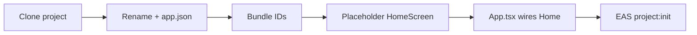
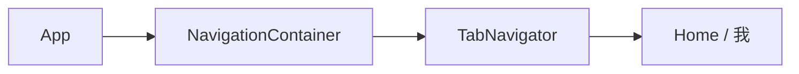
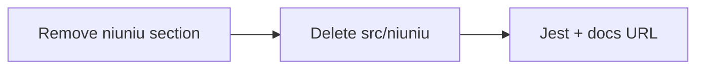
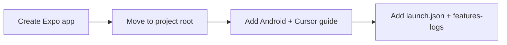
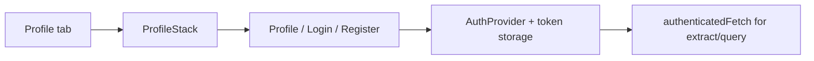
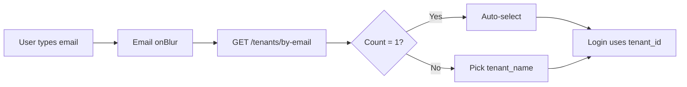
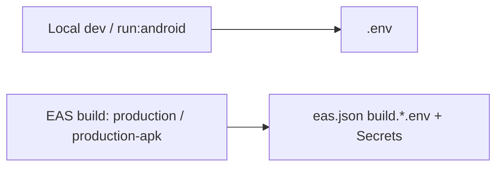
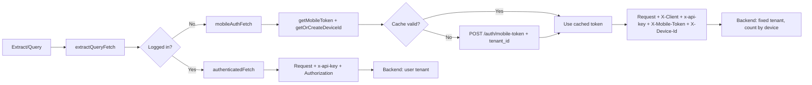
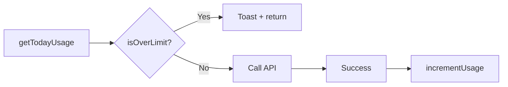

# Features / Changelog

## Rebrand + placeholder home (databasing-documents-mobile-apps)

- **Project name:** `databasing-documents-mobile-apps` in `package.json` and `app.json` (name + slug).
- **Native IDs:** iOS `bundleIdentifier` and Android `package` set to `com.herwidget.databasingdocuments`.
- **UI:** Previous calculator UI removed; app shows a placeholder home screen (`HomeScreen`) with app title and "Home — placeholder".
- **EAS:** New EAS project created and linked: `@herwidget/databasing-documents-mobile-apps` (ID: `38089b99-ce75-4136-a89f-dcee29a3ddac`). `app.json` → `extra.eas.projectId` updated.



## Tab: 我 (profile / settings)

- Bottom tab bar: **Home** and **我** (profile). React Navigation (`@react-navigation/native`, `@react-navigation/bottom-tabs`) + `react-native-screens`, `react-native-gesture-handler`. `TabNavigator` in `src/navigation/TabNavigator.tsx`; `ProfileScreen` placeholder in `src/screens/ProfileScreen.tsx`. Tab labels from `src/app-config.ts` (`TAB_LABEL_HOME`, `TAB_LABEL_PROFILE`).



## Remove niuniu (prior project code)

- Removed niuniu card calculator: docs (features-logs section), `src/niuniu/` (types, parse, combos, score, format, calc, tests), and related todo. Updated `jest.config.js` coverage pattern and docs EAS dashboard URL.



## Expo setup + Android & Cursor guide

- React Native project created with Expo (blank-typescript).
- Concise guide added: run on real Android device and debug in Cursor.



- **Run on device:** Enable USB debugging → `pnpm start` → Expo Go (QR or USB) or dev build.
- **Debug in Cursor:** React Native Tools + Expo extensions → Attach to packager (port 8081) → breakpoints in TS/TSX.
- **Android Studio:** `npx expo prebuild` → open project in Android Studio → run on emulator/device; use for native code and layout, keep Metro in Cursor. **Hot reload:** start `pnpm start` first, then Run from Android Studio so the app connects to Metro and Fast Refresh works.

## Auth: login, register, token refresh

- **API:** `POST /auth/register` (email, password, tenant_name, user_name → message, tenant_id); `POST /auth/login` (email, password, tenant_id → access_token, refresh_token, …); `POST /auth/refresh` (refresh_token, tenant_id → new tokens). Endpoints in `src/lib/api-config.ts`; client in `src/lib/auth/authApi.ts`.
- **Token storage:** AsyncStorage (`@react-native-async-storage/async-storage`) in `src/lib/auth/tokenStorage.ts`. JWT `exp` decoded in `src/lib/auth/jwtExp.ts`; refresh when token expires within 2 min in `src/lib/auth/refreshIfNeeded.ts`.
- **Shared fetch:** `authenticatedFetch()` in `src/lib/authenticatedFetch.ts` adds `Authorization: Bearer` and calls `refreshAccessIfNeeded()` before each request. Extract and query use `mobileAuthFetch()` (no login); see "Extract/query: mobile no-login" below.
- **UI:** Login and Register screens (Profile stack). Profile tab → ProfileStack (ProfileScreen, LoginScreen, RegisterScreen). ProfileScreen: when not logged in shows Login / Register; when logged in shows tenant_id + Logout. AuthProvider in App.tsx; `useAuth()` for auth state and setAuth/clearAuth.



## Field selector: checkbox, label-only, multi-column

- **Checkbox:** Field selection uses ☐/☑ (CHECKBOX_UNCHECKED / CHECKBOX_CHECKED in app-config) instead of circle/check.
- **Label only:** Field list shows only user-facing label (zh); internal en names (e.g. contract_no) are not shown; en is used only for API.
- **Layout:** Fields in a 3-column grid (flexWrap, ~31% width per cell, gap 8) for less scrolling.
- **Token:** Extract and query use `mobileAuthFetch` (X-Client + x-api-key + signed token; no login).

## Auth: tenant list by email (login)

- `GET /tenants/by-email?email=...` client: `src/lib/auth/tenantsApi.ts` (typed in `src/lib/auth/types.ts`).
- Login screen: when email input loses focus (`onBlur`), fetch tenants and show a selectable list by **tenant_name**; selection fills `tenant_id` internally for login.
- **Auto-select:** If exactly one tenant is returned, it is automatically selected (no manual tap needed).
- UI code is split into small auth module files under `src/screens/auth/` (Login/Register styles, hooks, tenant picker).



## Backend: x-api-key on all requests

- **Config:** `API_KEY` and `API_KEY_HEADER` in `src/lib/api-config.ts`; default key from constant, override via `EXPO_PUBLIC_API_KEY` in .env.
- **Usage:** Every backend request sends header `x-api-key: <API_KEY>`: `authenticatedFetch` (extract, query), `authApi` (register, login, refresh), `tenantsApi` (getTenantsByEmail).

## Releases: env handling for dev vs EAS production

- **Local dev & local release (`expo run:android --variant release`):** `.env` is used for values like `EXPO_PUBLIC_API_BASE_URL`.
- **EAS builds (`production`, `production-apk`):** Production API base URL comes from `eas.json` `build.production.env` / `build['production-apk'].env`. `.env.production` was removed to avoid confusion.



## Emulator: camera and document selection

- **Doc:** `docs/EMULATOR-CAMERA-DOCUMENTS.md` — how to take photos and select documents when developing with Android emulator or iOS Simulator.
- **Android:** Camera = set AVD Camera to Device (webcam); documents = drag file onto emulator or `adb push` to `/sdcard/Download/`, then pick in app.
- **iOS:** No real camera in Simulator; add images via drag to Simulator (Photos) or files via Files app; use device for real camera testing.

## Query: first-row raw_text as markdown (no SQL)

- **Behavior:** Query action shows `raw_text` from the first row of `rows` (string or multipart array), rendered as markdown; SQL is no longer shown.
- **API:** `getFirstRowRawTextMarkdown()` in `src/lib/queryApi.ts` normalizes first row `raw_text` (string or `[{ type, text }]`) to a single string.
- **UI:** `QuerySection` uses `react-native-markdown-display`; result in a scrollable block with max height.

```mermaid
flowchart LR
  A[POST /query] --> B[rows[0].raw_text]
  B --> C{string or array?}
  C -->|string| D[Markdown]
  C -->|multipart| E[Join .text]
  E --> D
  D --> F[QuerySection]
```

## Extract/query: mobile no-login (X-Client + x-api-key + signed token + X-Device-Id + tenant_id)

- **Goal:** Extract and query from the mobile app do not require login when user is not logged in; when logged in, extract/query use the **old logic** (Bearer token, user's tenant). No-login: backend accepts `X-Client: mobile` + `x-api-key` + signed token + `X-Device-Id`; data goes to a fixed tenant. Logged-in: `Authorization: Bearer` + `x-api-key`; data goes to user's tenant. Limited usage per day enforced in app.
- **Config:** `src/lib/api-config.ts` — `AUTH_MOBILE_TOKEN_ENDPOINT`, `MOBILE_CLIENT_HEADER`, `MOBILE_CLIENT_VALUE`, `MOBILE_TOKEN_HEADER`, `DEVICE_ID_HEADER`, `MOBILE_NO_LOGIN_TENANT_ID` (override via `EXPO_PUBLIC_MOBILE_TENANT_ID`), `MOBILE_TOKEN_TENANT_ID_KEY`, `MOBILE_TOKEN_REFRESH_THRESHOLD_MS`.
- **Token:** `src/lib/mobileToken.ts` — `getMobileToken()` calls `POST /auth/mobile-token` with `x-api-key` and body `{ tenant_id }`; caches token and refreshes when within 1 min of expiry; `clearMobileTokenCache()` for tests/logout.
- **Device id:** `src/lib/deviceId.ts` — `getOrCreateDeviceId()` returns a stable UUID stored in SecureStore (`device_id_v1`); generated once per install. Sent as `X-Device-Id` for backend per-device counting.
- **Fetch choice:** `src/lib/extractQueryFetch.ts` — `extractQueryFetch()`: if user is logged in (valid access token from `refreshAccessIfNeeded()`), uses `authenticatedFetch` (old logic, user's tenant); else uses `mobileAuthFetch` (no-login, fixed tenant). Used by `extractApi.ts` and `queryApi.ts`.
- **Fetches:** `authenticatedFetch` (x-api-key + Authorization); `mobileAuthFetch` (x-api-key, X-Client, X-Mobile-Token, X-Device-Id).



## No-login query scoping + 7-day notice

- **Goal:** No-login users share one tenant; query must be scoped to their own documents. Use `document_version_id` from the latest extract response; send `document_version_ids` in the query request body so the backend returns only those documents. Also inform unlogged users that uploaded documents may be deleted after 7 days.
- **Extract response:** `src/lib/extractApi.ts` — typed `ExtractResponse` with `results[].document_id`, `document_version_id`, etc. On extract success, `getDocumentVersionIdsFromExtractResponse(data)` collects ids and `setLatestExtractDocumentVersionIds(ids)` stores them.
- **Store:** `src/lib/latestExtractVersions.ts` — in-memory `setLatestExtractDocumentVersionIds(ids)`, `getLatestExtractDocumentVersionIds()`. Keeps at most 5 ids (latest extract only).
- **Query body:** Body is always `{ query: string }`. When not logged in and we have ids, append `,并且[document_version_ids:1,2,…]` to the query string; backend parses and scopes by those ids.

  **Example** (no-login, ids `[1, 2, 3]`):
  ```json
  { "query": "本科专业为工商管理的简历,并且[document_version_ids:1,2,3]" }
  ```
  Backend strips the suffix, uses `1,2,3` to scope results, and runs the query on the text before the comma.

- **Notice:** `NOTICE_NO_LOGIN_7DAY` in app-config; `HomeScreen` shows a notice banner when `!auth`: testing mode, documents may be deleted after 7 days.
- **UI:** Extract no longer requires login; unlogged users can extract then query (query scoped to latest extract’s document versions).

```mermaid
flowchart LR
  A[Extract success] --> B[Parse results[].document_version_id]
  B --> C[setLatestExtractDocumentVersionIds]
  D[Query] --> E{Logged in?}
  E -->|No| F[Append ,并且[document_version_ids:…] to query]
  E -->|Yes| G[Body: query only]
  F --> H[Backend scopes to those docs]
  G --> I[Backend: user tenant]
```

## Per-day usage limits (extract & query)

- **Goal:** Limit how many times per day a user can use extract and query (e.g. 5 each); reset at midnight (device local date). Clear notice for both front and backend enforcement.
- **Storage:** `src/lib/usageLimits.ts` — daily `{ date, extract, query }` in SecureStore (`usage_limits_v1`); `getTodayUsage()`, `incrementUsage(kind)`, `isOverLimit(kind, usage, limit)`.
- **Config:** `src/app-config.ts`: `USAGE_DAILY_LIMIT`, `MSG_USAGE_EXTRACT_LIMIT`, `MSG_USAGE_QUERY_LIMIT`, `MSG_DEVICE_DAILY_LIMIT` (no-login: “今日次数已达上限（设备限制）。登录后可继续使用。”).
- **Front enforcement:** When over limit before API call, toast: logged-in → `MSG_USAGE_*_LIMIT`; no-login → `MSG_DEVICE_DAILY_LIMIT`.
- **Backend 429:** When API returns 429, `src/lib/apiError.ts` `getErrorFromResponse()` parses body: if `detail.error_code === "MOBILE_DEVICE_LIMIT_EXCEEDED"` returns Chinese notice `MSG_DEVICE_DAILY_LIMIT`; else uses `detail` (string) or `detail.message`. Extract/query APIs pass result to UI; toast shows error in `text2`.
- **Extract:** `DocumentUploadSection` — check limit → toast (no-login message when `!auth`); on API error show `result.error`. After successful extract `incrementUsage('extract')`.
- **Query:** `QuerySection` — same; on API error show `res.error` in toast `text2`.



## Debug in Cursor (breakpoints + Expo)

- **Doc:** `docs/DEBUG-CURSOR-EXPO.md` — how to add breakpoints in Cursor and attach to Expo; industry practices for debugging React Native/Expo (breakpoints, Chrome DevTools, React DevTools, Flipper, dev menu).

