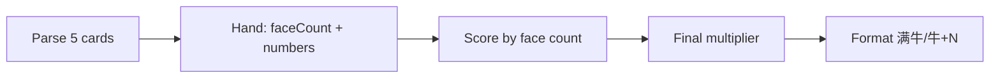

# Features / Changelog

## 牛牛纸牌计算器 (niuniu card calculator)

- **Input:** 5 cards：数字 1 用 A 显示，2–10、J/Q/K.
- **Logic:** 5花牌→满牛5倍；4花牌→剩1张数字为得分(10则满牛)4倍；**3/2/1张花牌：花牌当10，任三张和%10=0才有分，得分=剩余两张和%10（0当10）**，倍数3或按得分；0花牌→5数字任三和%10=0，得分=剩余两张和%10。最终倍数：得分10用上述倍数，7/8/9→2，1–6→1。
- **Output:** 满牛 + 倍数, or 牛{得分} + 倍数; no 牛 → 没有牛. 原因只显示：三张凑成10的倍数（牌面）、剩余两张（牌面），牌面按数字升序显示；花牌用 J/Q/K 不显示 10.
- **UI:** 纸牌值按钮(J/Q/K/1–10)选5张后自动计算，无计算按钮；**删除**按钮可删除最后一个已输入数字（已输入为空时禁用）；另一局按钮重置；**得分和倍数**突出显示（大号加粗、蓝框浅底），原因另起一行小字。
- **Tests:** Jest + ts-jest; `src/niuniu/__tests__/calc.test.ts` 覆盖 5/4/3/2/1/0 张花牌、5张数字牌(有牛/无牛)、倍数、输出格式与得分原因。详见下方「测试场景与运行」。



- **Modules:** `src/niuniu/` (constants, types, parse, combos, score, format, calc), `src/screens/CalculatorScreen.tsx`; App wires calculator screen.

**1用A显示：** UI 牌面选项首项为 A（2–10、J/Q/K）；parse 接受 A/a 解析为 1；format 中 labelToSortValue 将 A 按 1 排序，joinValues 将数值 1 显示为 A。


### 测试场景与运行 (Test scenarios & run)

**运行测试：**

```bash
pnpm test
```

**测试文件：** `src/niuniu/__tests__/calc.test.ts`

**场景一览：**

| 场景 | 示例牌 | 预期 |
|------|--------|------|
| 5张花牌 | J,Q,K,J,Q | 满牛，倍数 5，原因 5张花牌 |
| 4张花牌 + 1数字 | J,Q,K,J,7 | 牛7，倍数 2，原因列出 [7] |
| 4张花牌 + 1数字(1–6) 有牛且倍数 1 | J,Q,K,J,3 | 牛3，倍数 1 |
| 4张花牌 + 10 | J,Q,K,J,10 | 满牛，倍数 4 |
| 3张花牌(当10) 任三和%10=0 剩余两张和%10 | J,Q,K,3,7 | 满牛，倍数 3，原因 [3,7] |
| 3张花牌 剩余两张和%10≠0 | J,Q,K,2,5 | 牛7，倍数 2 |
| 3张花牌 剩余两张和%10∈1–6 有牛且倍数 1 | J,Q,K,1,2 | 牛3，倍数 1 |
| 2张花牌 任三张和%10=0 | J,Q,3,7,10 | 满牛，倍数 3，原因剩余2张 [3,7] |
| 2张花牌 有牛且倍数 1 | J,Q,10,1,2 | 牛3，倍数 1，原因剩余2张 [1,2] |
| 2张花牌 2倍(牛7) | J,Q,10,2,5 | 牛7，倍数 2，原因剩余2张 [2,5] |
| 2张花牌 无任三张和%10=0 | J,Q,1,2,3 | 没有牛 |
| 1张花牌 任三张和%10=0 剩余两张和%10 | Q,9,7,4,3 | 牛3，倍数 1，原因剩余2张 [9,4] 等 |
| 1张花牌 满牛 | Q,3,7,5,5 | 满牛，倍数 3，原因剩余2张 [5,5] |
| 1张花牌 2倍(牛7) | Q,2,5,3,7 | 牛7，倍数 2，原因剩余2张 [2,5] |
| 1张花牌 + 4数字(无) | Q,1,2,3,4 | 没有牛 |
| 5张数字(有3张和%10=0) | 9,7,4,3,6 | 牛9，倍数 2 |
| 5张数字(三张和=10，余二和%10=0) | 10,9,1,5,5 | 满牛，倍数 3 |
| 5张数字 有牛且倍数 1 | 1,4,5,2,2 | 牛4，倍数 1，原因剩余2张 [2,2] |
| 5张数字(无三张和%10=0) | 1,1,2,2,2 | 没有牛 |
| 倍数：得分 7/8/9 | — | 倍数 2 |
| 倍数：得分 1–6（有牛且倍数 1） | 牛1: 2,4,4,1,10；牛2: 5,3,2,1,1；牛3: Q,9,7,4,3；牛4: 1,4,5,2,2；牛5: 2,3,5,1,4；牛6: 2,3,5,1,5 | 倍数 1 |

（解析：张数错误/无效牌面 由按钮输入故不存在，不测。）

## Expo setup + Android & Cursor guide

- React Native project created with Expo (blank-typescript).
- Concise guide added: run on real Android device and debug in Cursor.


- **Run on device:** Enable USB debugging → `pnpm start` → Expo Go (QR or USB) or dev build.
- **Debug in Cursor:** React Native Tools + Expo extensions → Attach to packager (port 8081) → breakpoints in TS/TSX.
- **Android Studio:** `npx expo prebuild` → open project in Android Studio → run on emulator/device; use for native code and layout, keep Metro in Cursor. **Hot reload:** start `pnpm start` first, then Run from Android Studio so the app connects to Metro and Fast Refresh works.
