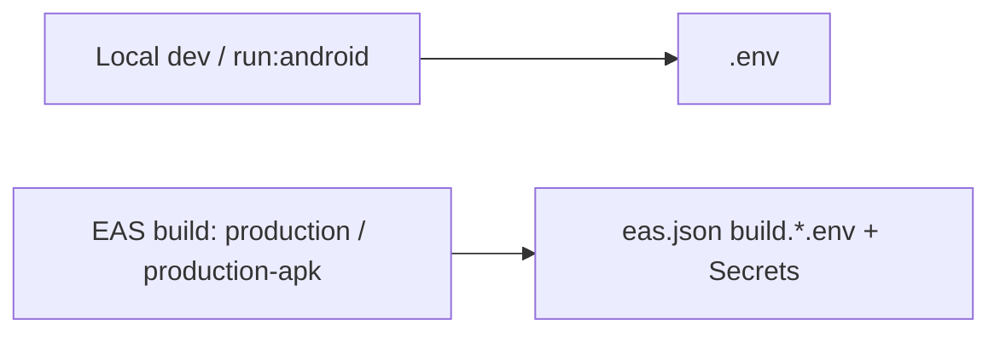

## Release builds & environment variables

- **Local dev & local release (`expo run:android --variant release`):** Expo loads environment variables from `.env` (and your shell). `.env.production` is **not** used automatically.
- **Cloud EAS builds (APK/AAB):** EAS Build does **not** read `.env` / `.env.production` from the build server. Environment variables must be configured via `eas.json` (`build.*.env`) and/or EAS Secrets.

### Recommended setup

- **Development builds:** Keep local values in `.env` (e.g. `EXPO_PUBLIC_API_BASE_URL` pointing at your LAN/dev backend).
- **Production builds (EAS):** Put production values in the `env` block of the `production` / `production-apk` profiles in `eas.json` (and EAS Secrets for sensitive keys).

